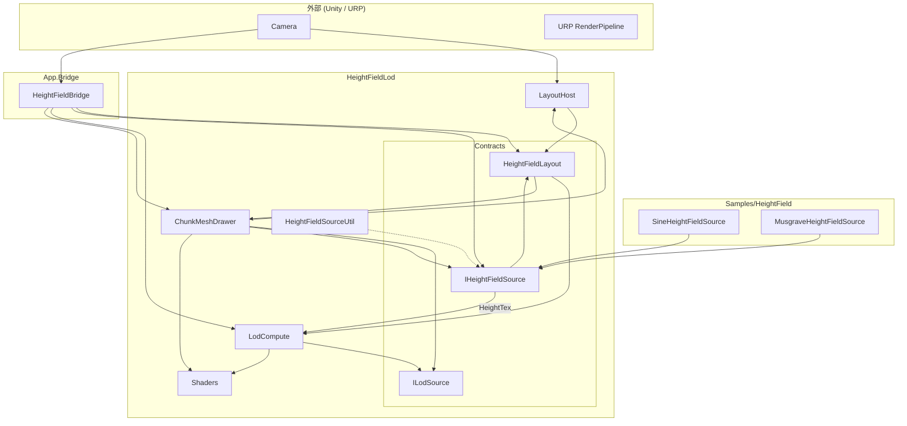

# Heightfield LOD — 多レイヤー設計

> 英語版: [heightfield-lod-layered-design.md](heightfield-lod-layered-design.md)  
> 詳細仕様（Quad 規約・曲率 LOD・シェーダ）: [urp-heightfield-lod-design.ja.md](urp-heightfield-lod-design.ja.md)

---

## このドキュメントの位置づけ

| ドキュメント | 読む内容 |
| --- | --- |
| **本書** | モジュール境界、コンテキストマップ、N/K/M 構成、参照・更新のルール |
| [urp-heightfield-lod-design.ja.md](urp-heightfield-lod-design.ja.md) | 単一 heightfield のアルゴリズム（曲率、LOD 閾値、チャンクメッシュ、座標） |
| [head-sway-lens-shift-camera.md](head-sway-lens-shift-camera.md) | カメラ行列のみの揺れ（ジオメトリ固定） |

---

## 全体構成（要約）

正射影向けの **適応 heightfield**。任意メッシュ仮想化（Nanite）ではない。

```text
┌─────────────────────────────────────────────────────────────────┐
│ App（シーン組み立て）                                              │
│   HeightFieldBridge … Rig の Allocate / Configure               │
└────────────────────────────┬────────────────────────────────────┘
                             │
┌────────────────────────────▼────────────────────────────────────┐
│ HeightFieldLod（コア）                                            │
│   Contracts … IHeightFieldSource, HeightFieldLayout, ILodSource │
│   Layout / Compute / Draw / Util / Shaders                      │
└────────────────────────────▲────────────────────────────────────┘
                             │ 参照（契約のみ）
┌────────────────────────────┴────────────────────────────────────┐
│ Samples/HeightField（任意の Height 実装）                           │
│   SineHeightFieldSource, MusgraveHeightFieldSource              │
└─────────────────────────────────────────────────────────────────┘
```

**3 段階パイプライン**

| 段 | 責務 | 主な型 |
| --- | --- | --- |
| 1. Height | 高さ RT を書く | `IHeightFieldSource` → `HeightTex` × **N** |
| 2. LOD | 法線・曲率・分類・インスタンス | `HeightFieldLodCompute` × **K**（`ILodSource`） |
| 3. Draw | チャンクメッシュ描画 | `HeightFieldChunkMeshDrawer` × **M** |

**記号:** **N** = Height RT 本数、**K** = LOD Compute 数、**M** = Drawer（レイヤー）数。  
**K : M** は多対多。同一 `ILodSource` を複数 Drawer が参照して LOD を共有する。

---

## コンテキストマップ

### 境界づけられたコンテキスト

| コンテキスト | asmdef | 責務 | 公開の契約 |
| --- | --- | --- | --- |
| **HeightFieldLod** | `HeightFieldLod` | 契約、layout、曲率/LOD、描画、シェーダ | `IHeightFieldSource`, `HeightFieldLayout`, `ILodSource` |
| **Samples** | `HeightField.Samples` | サンプル Height 実装 | `SineHeightFieldSource` 等 |
| **App.Bridge** | `App` | シーン Rig の配線 | `HeightFieldBridge` |
| **Unity / URP** | — | カメラ、レンダーパイプライン | 外部 |

### コンテキスト関係図



**関係の読み方（矢印 = 依存・データの向き）**

| From | To | 関係 |
| --- | --- | --- |
| `HeightFieldLayoutHost` | `HeightFieldLayout` | カメラから layout を生成・共有 |
| `HeightFieldBridge` | `IHeightFieldSource` | `Allocate(layout)` |
| `HeightFieldBridge` | `HeightFieldLodCompute` | `Configure(layout)` |
| `HeightFieldChunkMeshDrawer` | `ILodSource` | 描画データ（**フォワード参照**） |
| `HeightFieldChunkMeshDrawer` | `IHeightFieldSource` | 任意。pull で `EnsureUpdated` |
| `HeightFieldLodCompute` | `HeightTex` | 入力（Compute は他 Compute を参照しない） |
| `HeightField.Samples` | `IHeightFieldSource`（HeightFieldLod 契約） | サンプル Height 実装 |
| `App` | `HeightFieldLod`, `HeightField.Samples` | asmdef 参照 |

### 依存ルール（コンパイル時）

```text
App                 → HeightFieldLod, HeightField.Samples
HeightField.Samples → HeightFieldLod（契約のみ）
HeightFieldLod      → Unity / URP のみ
```

- **HeightFieldLod** は Samples の具象型を知らない（`IHeightFieldSource` のみ）。
- **Samples** は LOD 側の契約を実装する（依存性逆転）。

### 統合パターン（ランタイム）

| パターン | 説明 |
| --- | --- |
| **共有 layout** | `HeightFieldLayoutHost` 1 つ（推奨）または Bridge が `FromCamera` |
| **共有 Height** | 複数 Drawer が同じ `IHeightFieldSource` / 同じ `HeightTex` |
| **共有 LOD** | 複数 Drawer が同じ `ILodSource`（= 同じ `HeightFieldLodCompute`） |
| **層の姿勢** | 各 Drawer の `Transform`（OS で `-h` → `ObjectToWorld`） |

モード enum は使わない。Inspector の参照だけで表現する。

### フォルダ構成（`Assets/`）

```text
HeightFieldLod/                 asmdef: HeightFieldLod
  Contracts/
    IHeightFieldSource.cs       namespace HeightField
    HeightFieldLayout.cs        namespace HeightField
    ILodSource.cs               namespace HeightFieldLod
  Layout/
    HeightFieldLayoutHost.cs
  Compute/
    HeightFieldLodCompute.cs
  Draw/
    HeightFieldChunkMeshDrawer.cs
    ChunkInstanceData.cs
    ChunkMeshBuilder.cs
  Util/
    HeightFieldSourceUtil.cs     namespace HeightField
  Shaders/
  HeightFieldLod.asmdef

Samples/HeightField/            asmdef: HeightField.Samples → HeightFieldLod
  SineHeightFieldSource.cs
  MusgraveHeightFieldSource.cs
  Shaders/
  HeightField.Samples.asmdef

App/                            asmdef: App → HeightFieldLod, HeightField.Samples
  Bridge/
  Editor/
```

---

## ランタイム構成（シーン）

### 典型 Rig（1 レイヤー）

```text
HeightFieldRig (GameObject)
  ├─ HeightFieldLayoutHost      … カメラ + barrier → Layout
  ├─ HeightFieldBridge          … OnEnable: Allocate + Configure
  ├─ SineHeightFieldSource      … IHeightFieldSource (例)
  ├─ HeightFieldLodCompute      … ILodSource
  └─ HeightFieldChunkMeshDrawer … _lod → Compute, Transform で層
```

### 多レイヤー（M > 1）

```text
HeightTex A  ──→  LodCompute α  ──┬── Drawer 1 (Transform T1, Material M1)
                                  └── Drawer 2 (Transform T2, Material M2)

HeightTex B  ──→  LodCompute β  ──── Drawer 3
```

- **推奨:** 同じ Height → **Compute 1 つ + Drawer 複数**（LOD/`GetData` は 1 回/フレーム）。
- **非推奨:** 同じ HeightTex に Compute を複数（動くが無駄に GPU/CPU が増える）。

---

## フレームフロー（pull）

```text
[毎フレーム]
  Bridge.Update
    → layout 変化時: source.Allocate(layout), compute.Configure(layout)

[beginCameraRendering / 各 Drawer]
  1. heightSource.EnsureUpdated(layout, time)   // Time.frameCount で 1 回/ソース
  2. lod.EnsureUpdated(layout, height)          // Time.frameCount で 1 回/Compute
  3. DrawMeshInstancedIndirect × LOD 段
```

| ステップ | 主体 | ガード |
| --- | --- | --- |
| Height 更新 | `HeightFieldSourceUtil` | `Time.frameCount` + ソース参照 |
| LOD 更新 | `HeightFieldLodCompute` | `Time.frameCount` + 同一 `height` RT |
| 描画 | `HeightFieldChunkMeshDrawer` | カメラ cullingMask / `_camera` フィルタ |

**Compute→Compute 参照はない。** 更新順は Drawer の描画コールバック起点で足りる。

---

## コンポーネント責務（詳細）

### `HeightFieldLayoutHost`

| 項目 | 内容 |
| --- | --- |
| 役割 | **Layout の単一の生成元**（カメラ pixel / ortho / barrier） |
| 再生成条件 | `pixelWidth`, `pixelHeight`, `orthographicSize` |
| しないこと | Height / LOD / Draw |

### `HeightFieldBridge`

| 項目 | 内容 |
| --- | --- |
| 役割 | Rig の **初期化**（`Allocate` + `Configure`） |
| しないこと | 毎フレームの LOD（Drawer が pull） |

### `IHeightFieldSource` / `HeightFieldSourceUtil`

| 項目 | 内容 |
| --- | --- |
| 役割 | Height RT の確保と更新 |
| `EnsureUpdated` | 同一フレームの二重 `UpdateHeight` を防止 |

### `HeightFieldLodCompute` / `ILodSource`

| 項目 | 内容 |
| --- | --- |
| 役割 | Normal / Curvature / Classify / Neighbor / `GetData` / instance buffers |
| 所有 | 書き込み RT・buffer は **Compute インスタンスごと** |
| 入力 | `RenderTexture` height（呼び出し側が渡す） |
| LOD 閾値 | **HeightTex ごとに固定**（レイヤーで変えない） |

### `HeightFieldChunkMeshDrawer`

| 項目 | 内容 |
| --- | --- |
| 役割 | `ILodSource` を参照して間接描画 |
| 参照 | `_lod`（必須）, `_layoutHost`（推奨）, `_heightSource`（pull 用） |
| 層 | **GameObject の Transform** |

---

## 座標系と `h`

[urp-heightfield-lod-design.ja.md](urp-heightfield-lod-design.ja.md) の Quad 規約に従う。

| 項目 | 規約 |
| --- | --- |
| 高さ | `P_os = (x, y, z_skirt - h)` → `TransformObjectToWorld` |
| 法線 | 法線 RT は OS 勾配 → `TransformObjectToWorldNormal` |
| 層の前後 | **Transform**（位置・回転）+ 描画順 |
| 頭振り | ジオメトリ固定・カメラ行列のみ変更 |

---

## `GetData` と共有

唯一の呼び出し: `HeightFieldLodCompute.BuildInstanceLists` 内の `_lodBuffer.GetData`。

同一 `ILodSource` を複数 Drawer が参照 → **GetData は 1 回/フレーム**、描画は M 回。

---

## 実装状況

| Phase | 内容 | 状態 |
| --- | --- | --- |
| 0 | 設計・コンテキストマップ | 本書 |
| 1 | OS で `h`、法線 Transform | 済（main） |
| 2 | Compute / Drawer 分割、`ILodSource` | 済（feature  branch） |
| 3 | 多 Drawer・共有参照 | 実装済・シーン検証は継続 |
| 4 | 法線回転の統一、描画順、Editor | 一部済 |

---

## テスト観点

| ケース | 期待 |
| --- | --- |
| 1 Drawer、identity | 基準見た目 |
| 2 Drawer、同一 `ILodSource`、Transform ずらし | LOD 1 回、面が重ならない |
| 2 Drawer、別 HeightTex | 独立形状 |
| Rig 回転 | `h` がローカル -Z に追従 |
| Head sway | 板固定 |

---

## 将来

- GPU バケット化（`GetData` 排除）
- レイヤーごと別 layout / カメラ
- view 空間での h（カメラ回転と板固定の両立が必要な場合）
- Clipmap / geomorph、UPM 化

---

## 関連ドキュメント

- [urp-heightfield-lod-design.ja.md](urp-heightfield-lod-design.ja.md)
- [head-sway-lens-shift-camera.md](head-sway-lens-shift-camera.md)
