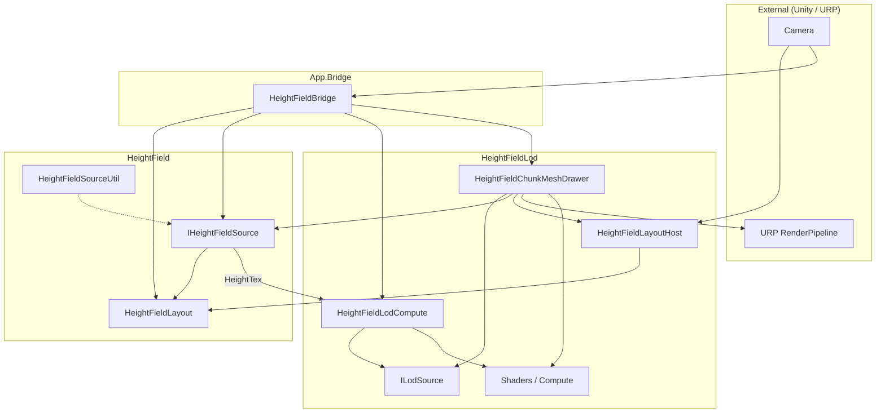

# Heightfield LOD — Layered Design

> Japanese: [heightfield-lod-layered-design.ja.md](heightfield-lod-layered-design.ja.md)  
> Algorithm spec: [urp-heightfield-lod-design.md](urp-heightfield-lod-design.md)

---

## Document map

| Doc | Scope |
| --- | --- |
| **This doc** | Context map, module boundaries, N/K/M runtime, pull updates |
| [urp-heightfield-lod-design.md](urp-heightfield-lod-design.md) | Curvature LOD, chunk mesh, Quad coords, shaders |
| [head-sway-lens-shift-camera.md](head-sway-lens-shift-camera.md) | Lens-shift camera only |

---

## System overview

Orthographic **adaptive heightfield** (not Nanite-style mesh virtualization).

```text
App (Bridge)           → wires rig: Allocate / Configure
HeightField              → HeightFieldLayout, IHeightFieldSource
HeightFieldLod           → LayoutHost, LodCompute, ChunkMeshDrawer, ILodSource
Unity / URP              → Camera, RenderPipeline
```

**Pipeline:** (1) Height `N` RTs → (2) LOD `K` computes → (3) Draw `M` drawers.  
**K:M** many-to-many; multiple drawers may share one `ILodSource`.

---

## Context map

### Bounded contexts

| Context | asmdef | Responsibility | Public contracts |
| --- | --- | --- | --- |
| **HeightField** | `HeightField` | Layout, height generation | `HeightFieldLayout`, `IHeightFieldSource` |
| **HeightFieldLod** | `HeightFieldLod` | Curvature/LOD, indirect draw | `ILodSource`, Compute, Drawer |
| **App.Bridge** | `App` | Scene rig wiring | `HeightFieldBridge` |
| **App (opt.)** | `App` | Head sway / view motion | orthogonal to HF |
| **Unity / URP** | — | Camera, pipeline | external |

### Context diagram



### Compile-time dependencies

```text
App            → HeightField, HeightFieldLod
HeightFieldLod → HeightField
HeightField    → Unity only
```

### Integration patterns

| Pattern | How |
| --- | --- |
| Shared layout | `HeightFieldLayoutHost` (recommended) |
| Shared height | Same `IHeightFieldSource` / `HeightTex` |
| Shared LOD | Multiple drawers → same `ILodSource` |
| Layer pose | Per-drawer `Transform` |

No mode enum — Inspector references only. No compute→compute references.

---

## Scene layout

```text
HeightFieldRig
  HeightFieldLayoutHost
  HeightFieldBridge
  IHeightFieldSource (e.g. Sine)
  HeightFieldLodCompute    (ILodSource)
  HeightFieldChunkMeshDrawer  → references _lod, optional _heightSource
```

Multi-layer: one `LodCompute` per height, many drawers referencing it (recommended).

---

## Frame flow (pull)

```text
Bridge.Update     → rebuild Allocate/Configure on layout change

Drawer (per camera):
  heightSource.EnsureUpdated(layout, time)   // Time.frameCount guard
  lod.EnsureUpdated(layout, height)
  DrawMeshInstancedIndirect
```

---

## Component roles

| Component | Role |
| --- | --- |
| `HeightFieldLayoutHost` | Build/share `HeightFieldLayout` from camera |
| `HeightFieldBridge` | Rig init: Allocate + Configure |
| `HeightFieldLodCompute` | GPU LOD; owns RTs/buffers; implements `ILodSource` |
| `HeightFieldChunkMeshDrawer` | Pull update + draw; owns Transform/material |
| `ILodSource` | Drawer-facing LOD outputs |
| `IHeightFieldSource` | Height RT writer |

`GetData` runs once per `ILodSource` per frame inside `HeightFieldLodCompute`.

---

## Coordinates

Object-space `-h` → `TransformObjectToWorld`. See [urp-heightfield-lod-design.md](urp-heightfield-lod-design.md).

---

## Implementation status

| Phase | Status |
| --- | --- |
| OS height path | Done (main) |
| Compute / Drawer split | Done (feature branch) |
| Multi-drawer sharing | Implemented; scene QA ongoing |

---

## Related

- [urp-heightfield-lod-design.md](urp-heightfield-lod-design.md)
- [head-sway-lens-shift-camera.md](head-sway-lens-shift-camera.md)
